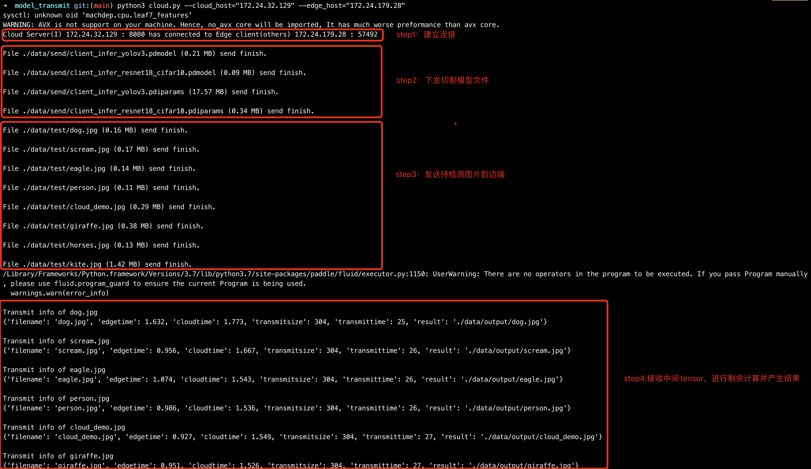
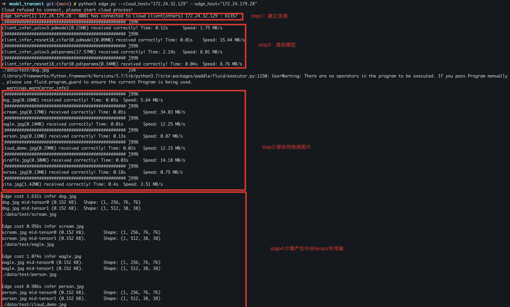
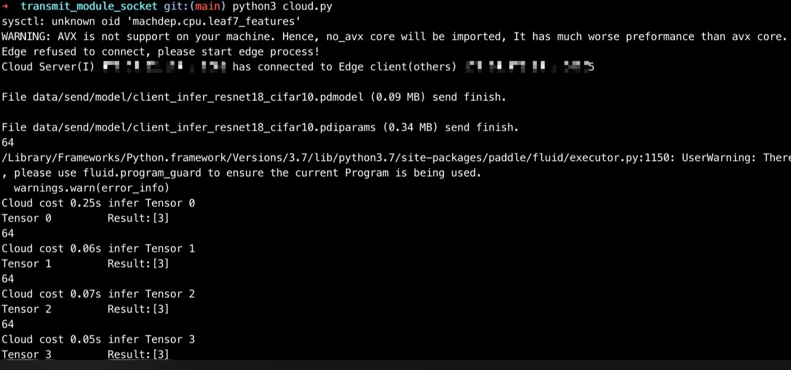
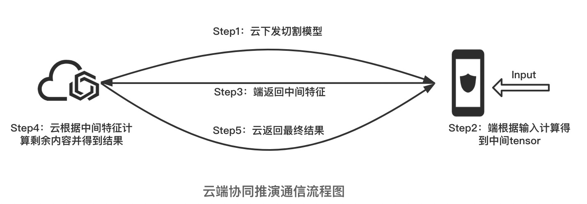
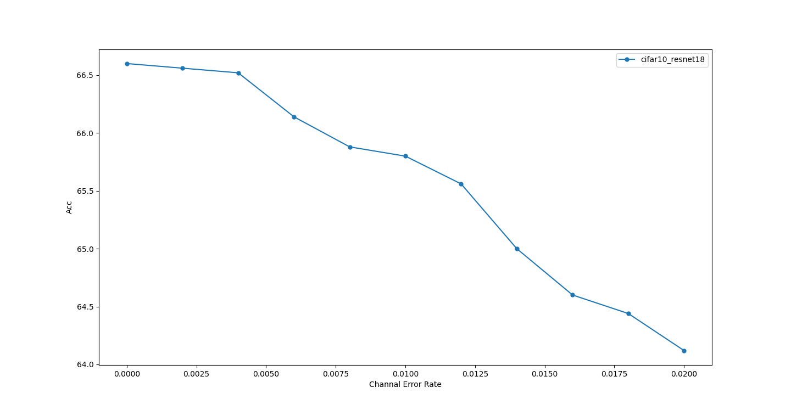
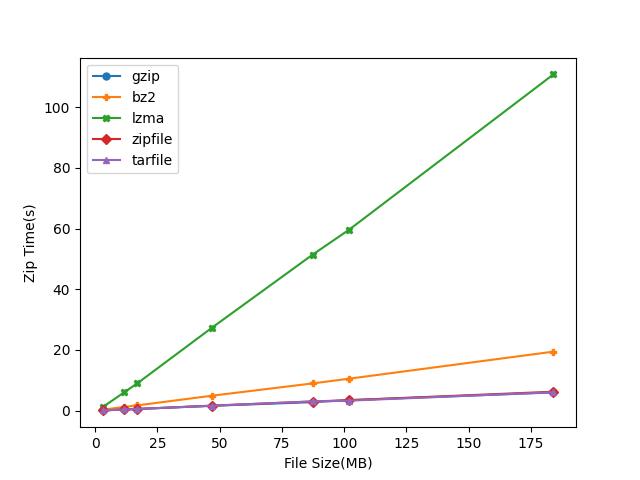
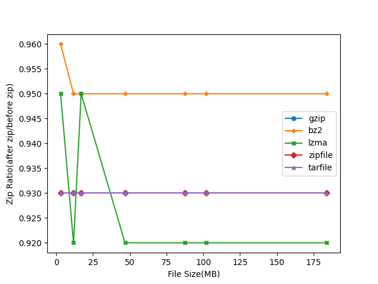
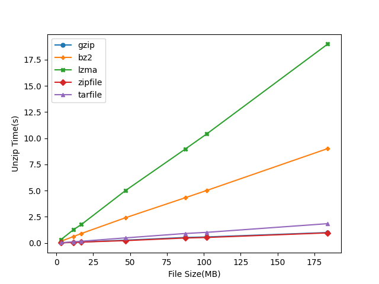

# transmit_module_socket
**基于Socket的通信模块**
## 文件说明

- `client.py`：客户端接收文件，对于云接收tensor，对于端接收分割模型；
- `server.py`：服务端发送文件，对于云发送分割模型，对于端发送tensor；
- `cloud.py`：启动云的发送和接收线程；
- `edge.py`：启动端的发送和接收线程；
- `core.py`：配置参数；
- `load_model`：模型部署函数，包括云和端加载方法（图像分类/目标检测）；
- `channal_noise`：信道噪声，对原tensor进行二进制信道翻转；
- `zip.py`：数据压缩，包括5种算法库，已封装；
- data：存储数据
    - send：切割模型存储路径（针对云）
    - receive：端接收到切割模型存储路径（针对端）
    - test：用户上传测试图片路径（针对云和端）
    - output：检测结果保存路径（针对云）

## Quick Start

```bash
# 云进程
$ python3 cloud.py 
    --cloud_host "xxx.xxx.xxx.xxx"  # 云IP
    --edge_host "xxx.xxx.xxx.xxx"   # 端IP
    --cloud_port xxxx   # 云接收端口
    --edge_port xxxx    # 端接收端口

# 端进程
$ python3 edge.py 
    --cloud_host "xxx.xxx.xxx.xxx"  # 云IP
    --edge_host "xxx.xxx.xxx.xxx"   # 端IP
    --cloud_port xxxx   # 云接收端口
    --edge_port xxxx    # 端接收端口
    --channal_error 0~0.02 # 信道误码率
```

Tips
1. host默认为本机测试：`127.0.0.1（CLOUD_HOST）`和`127.0.0.1（EDGE_HOST）`，port默认为：`8080（CLOUD_SENDTO_EDGE）`和`8081（EDGE_SENDTO_CLOUD）`，云端和边端启动参数应相同。
2. 信道误码率默认为`0`。

## 运行示例(目标检测)

### 云服务器
<div align=center> 
    
</div>

### 端设备
<div align=center> 
    
</div>

<!-- ### 云服务器
<div align=center> 
    
</div>

### 端设备
<div align=center> 
    
</div> -->

## 通信传输模块

### 流程图及解释
<div align=center> 
    
</div>
该项目涉及通信相关的内容：

1. 云下发切割后的部分模型给端设备，包括模型骨架`*.pdmodel`和模型参数`*.pdiparams`两个文件；
2. 输入待检测内容，端根据部分模型进行计算得到中间tensor；
3. 端加入信道干扰，对tensor进行二进制翻转，使用memoryview进行传输；
4. 云根据中间tensor进行剩余部分的计算，得到最终结果；
5. 云发送最终结果给端进行展示。

### 线程说明

通信过程包括4个线程，其中云和端各两个线程：

云：

1. 发送模型线程，该线程轮询检测`data/send`中是否有新产生的模型，若有则发送至端；
2. 接收特征线程，该线程连接至端发送端口，接收中间特征并进行剩余运算；

端：

1. 发送特征线程，该线程根据`data/test`文件夹内容判断是否有新上传的图片；
2. 接收模型线程，该线程连接至云发送端口，接收切割模型并保存至`data/receive`；

## 信道干扰模块

### 定义
`泛化准确率`:二进制翻转信道上，误码率为p时的准确率。其中，在二进制翻转信道上，对于传输的每一位，该信道有p的概率将此位反转。此外，一般的准确率即p=0时的泛化准确率。

### 实现方式
根据误码率大生成小为tensor_shape的翻转向量R，R属于0或1。其中0代表该位翻转，1代表该位不翻转，则有以下情况
1. 原始：0，翻转位：0 --> 结果：1
2. 原始：0，翻转位：1 --> 结果：0
3. 原始：1，翻转位：0 --> 结果：0
4. 原始：1，翻转位：1 --> 结果：1

若原始数据为X，翻转后的向量为Y，则`Y = ~ (X ^ R)`

### 数据类型
目前提供两种输入类型，int8和float32，其中浮点型在翻转时会有精度损失（转型为int时造成的）。 

### 图像分类（cifar10 + Resnet18）
`测试数据`：500（50*10）images

`误码率`：(0,0.02,0.002)

<div align=center> 
    
</div>


## 数据压缩模块

### 压缩方法
<table>
<table>
    <thead>
        <tr>
            <td><strong>Python library</strong></td>
            <td><strong>压缩格式</strong></td>
            <td><strong>说明</strong></td>
        </tr>
    </thead>
    <tbody>
        <tr>
            <td><strong>gzip</strong></td>
            <td><strong>.gz</strong></td>
            <td>LZ77+Huffman coding</strong></td>
        </tr>
        <tr>
            <td><strong>bz2</strong></td>
            <td><strong>.bz2</strong></td>
            <td>首先用Burrows-Wheeler transform将重复出现的字符序列转换成同样字母的字符串，然后用move-to-front变换进行处理，最后使用哈夫曼编码进行压缩。</td>
        </tr>
        <tr>
            <td><strong>lzma</strong></td>
            <td><strong>.xz</strong></td>
            <td>LZMA 对数据流、重复序列大小以及重续序列位置单独进行了压缩。LZMA支持几种散列链变体、二叉树以及基数树作为它的字典查找算法基础</td>
        </tr>
        <tr>
            <td><strong>zipfile</strong></td>
            <td><strong>.zip</strong></td>
            <td>一种数据压缩和文档储存的文件格式</td>
        </tr>
        <tr>
            <td><strong>tarfile</strong></td>
            <td><strong>.tar</strong></td>
            <td>Unix和类Unix系统上的归档打包工具，可以将多个文件合并为一个文件，打包后的文件名亦为“tar”</td>
        </tr>
    <tbody/>
</table>

### 性能测试

- 测试数据格式均为`.pdiparams`
- 压缩时间：gzip ≈ zipfile ≈ tarfile < bz2 < lzma
- 压缩比例：lzma < gzip ≈ zipfile ≈ tarfile < bz2
- 解压时间：zipfile ≈ gzip < tarfile < bz2 < lzma

#### 压缩时间&比例对比 

<table>
    <thead>
        <tr>
            <td rowspan="2"><strong>Size(MB)</strong></td>
            <td colspan="2"><strong>gzip</strong></td>
            <td colspan="2"><strong>bz2</strong></td>
            <td colspan="2"><strong>lzma</strong></td>
            <td colspan="2"><strong>zipfile</strong></td>
            <td colspan="2"><strong>tarfile</strong></td>
        </tr>
        <tr>
            <td><strong>Time(s)</strong></td>
            <td><strong>Ratio</strong></td>
            <td><strong>Time(s)</strong></td>
            <td><strong>Ratio</strong></td>
            <td><strong>Time(s)</strong></td>
            <td><strong>Ratio</strong></td>
            <td><strong>Time(s)</strong></td>
            <td><strong>Ratio</strong></td>
            <td><strong>Time(s)</strong></td>
            <td><strong>Ratio</strong></td>
        </tr>
    </thead>
    <tbody>
        <tr>
            <td>3.0</td>
            <td>0.1</td>
            <td>0.93</td>
            <td>0.32</td>
            <td>0.96</td>
            <td>1.15</td>
            <td>0.93</td>
            <td>0.1</td>
            <td>0.93</td>
            <td>0.1</td>
            <td>0.93</td>
        </tr>
        <tr>
            <td>11.8</td>
            <td>0.4</td>
            <td>0.93</td>
            <td>1.25</td>
            <td>0.95</td>
            <td>6.11</td>
            <td>0.92</td>
            <td>0.4</td>
            <td>0.93</td>
            <td>0.4</td>
            <td>0.93</td>
        </tr>
        <tr>
            <td>17.0</td>
            <td>0.56</td>
            <td>0.93</td>
            <td>1.76</td>
            <td>0.95</td>
            <td>9.04</td>
            <td>0.93</td>
            <td>0.57</td>
            <td>0.93</td>
            <td>0.58</td>
            <td>0.93</td>
        </tr>
        <tr>
            <td>46.8</td>
            <td>1.61</td>
            <td>0.93</td>
            <td>4.93</td>
            <td>0.95</td>
            <td>27.3</td>
            <td>0.92</td>
            <td>1.67</td>
            <td>0.93</td>
            <td>1.62</td>
            <td>0.93</td>
        </tr>
        <tr>
            <td>87.3</td>
            <td>2.82</td>
            <td>0.93</td>
            <td>8.99</td>
            <td>0.95</td>
            <td>51.4</td>
            <td>0.92</td>
            <td>3.03</td>
            <td>0.93</td>
            <td>3.08</td>
            <td>0.93</td>
        </tr>
        <tr>
            <td>102</td>
            <td>3.47</td>
            <td>0.93</td>
            <td>10.55</td>
            <td>0.95</td>
            <td>59.65</td>
            <td>0.92</td>
            <td>3.47</td>
            <td>0.93</td>
            <td>3.31</td>
            <td>0.93</td>
        </tr>
        <tr>
            <td>184</td>
            <td>6.02</td>
            <td>0.93</td>
            <td>19.46</td>
            <td>0.95</td>
            <td>110.8</td>
            <td>0.92</td>
            <td>6.26</td>
            <td>0.93</td>
            <td>6.09</td>
            <td>0.93</td>
        </tr>
    </tbody>
</table>





### 解压时间对比
<table>
    <thead>
        <tr>
            <td><strong>Size(MB)</strong></td>
            <td><strong>gzip</strong></td>
            <td><strong>bz2</strong></td>
            <td><strong>lzma</strong></td>
            <td><strong>zipfile</strong></td>
            <td><strong>tarfile</strong></td>
        </tr>
    </thead>
    <tbody>
        <tr>
            <td>3.0</td>
            <td>0.02</td>
            <td>0.16</td>
            <td>0.31</td>
            <td>0.02</td>
            <td>0.03</td>
        </tr>
        <tr>
            <td>11.8</td>
            <td>0.07</td>
            <td>0.63</td>
            <td>1.29</td>
            <td>0.06</td>
            <td>0.12</td>
        </tr>
        <tr>
            <td>17.0</td>
            <td>0.1</td>
            <td>0.91</td>
            <td>1.77</td>
            <td>0.09</td>
            <td>0.17</td>
        </tr>
        <tr>
            <td>46.8</td>
            <td>0.27</td>
            <td>2.41</td>
            <td>5.0</td>
            <td>0.23</td>
            <td>0.49</td>
        </tr>
        <tr>
            <td>87.3</td>
            <td>0.53</td>
            <td>4.32</td>
            <td>8.96</td>
            <td>0.48</td>
            <td>0.91</td>
        </tr>
        <tr>
            <td>102</td>
            <td>0.58</td>
            <td>5.02</td>
            <td>10.42</td>
            <td>0.53</td>
            <td>1.02</td>
        </tr>
        <tr>
            <td>184</td>
            <td>1.0</td>
            <td>9.02</td>
            <td>19.0</td>
            <td>0.97</td>
            <td>1.85</td>
        </tr>
    </tbody>
</table>

